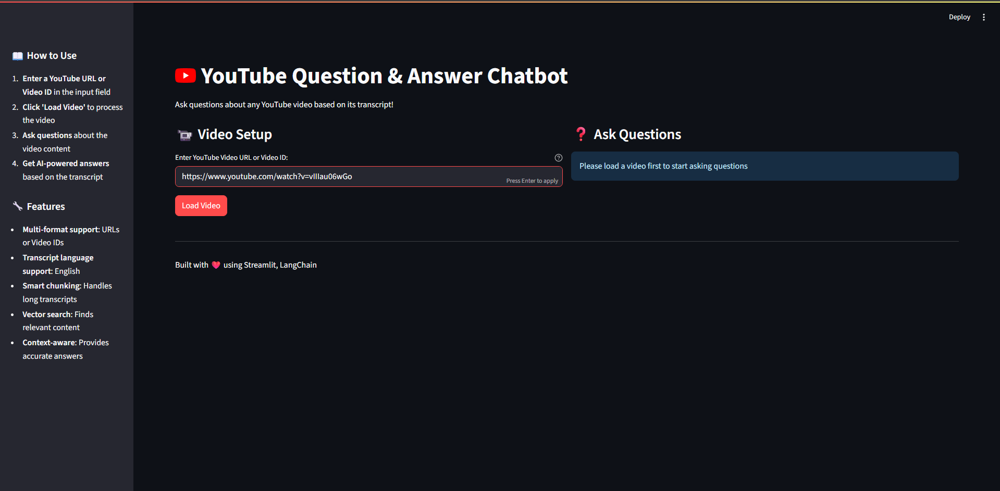
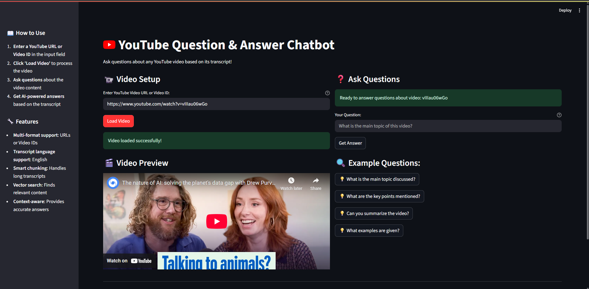
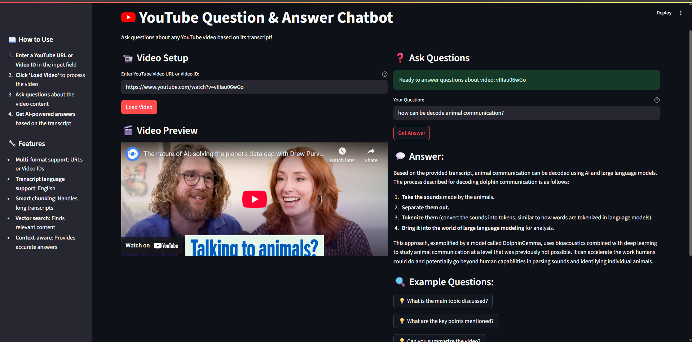

# YouTube Question & Answer Chatbot 🎬

A powerful AI-powered chatbot that analyzes YouTube video transcripts and answers questions about the video content using advanced language models and vector search technology.

## Screenshots 📸

### Main Interface


### Video Loading Process


### Q&A in Action


## Features ✨

- **Multi-format Support**: Accept YouTube URLs or direct video IDs
- **Intelligent Transcript Processing**: Automatically fetches and processes video transcripts
- **AI-Powered Q&A**: Uses Google's Gemini 2.5 Pro model for accurate answers
- **Vector Search**: Employs FAISS for efficient content retrieval
- **Smart Chunking**: Handles long transcripts by intelligently splitting content
- **Interactive Interface**: Clean, user-friendly Streamlit web interface
- **Video Preview**: Embedded video player for context

## Prerequisites 📋

- Python 3.11+
- Google API Key (for Gemini AI)
- Internet connection for YouTube transcript fetching

## Installation 🚀

1. **Clone the repository**
   ```bash
   git clone https://github.com/shakifahmed/youtube-qa-chatbot-gen-ai.git
   cd youtube-qa-chatbot-gen-ai
   ```

2. **Install dependencies**
   ```bash
   pip install -r requirements.txt
   ```

3. **Set up environment variables**
   
   Create a `.env` file in the project root:
   ```env
   GOOGLE_API_KEY=your_google_api_key_here
   ```
   
   Or for Streamlit Cloud deployment, add the API key to your Streamlit secrets.

## Required Dependencies 📦

```txt
streamlit
youtube-transcript-api
langchain
langchain-google-genai
langchain-community
faiss-cpu
python-dotenv
```

## Usage 🎯

1. **Start the application**
   ```bash
   streamlit run app.py
   ```

2. **Load a video**
   - Enter a YouTube URL (e.g., `https://www.youtube.com/watch?v=VIDEO_ID`)
   - Or just paste the `video ID` (11-character string)
   - Click `"Load Video"` to process the transcript

3. **Ask questions**
   - Type your question in the input field
   - Click `"Get Answer"` for AI-generated responses
   - Try the example questions for quick starts

## How It Works 🔧

1. **Transcript Extraction**: Uses YouTube Transcript API to fetch video transcripts
2. **Text Processing**: Splits long transcripts into manageable chunks using `RecursiveCharacterTextSplitter`
3. **Vector Embeddings**: Creates embeddings using Google's `text-embedding-004` model
4. **Vector Storage**: Stores embeddings in `FAISS` for efficient similarity search
5. **Question Processing**: Uses `MultiQueryRetriever` to find relevant transcript segments
6. **Answer Generation**: Employs `Gemini 2.5 Pro` to generate contextual answers

## Supported Video Formats 📹

- Standard YouTube URLs: `https://www.youtube.com/watch?v=VIDEO_ID`
- Short URLs: `https://youtu.be/VIDEO_ID`
- Embed URLs: `https://www.youtube.com/embed/VIDEO_ID`
- Direct video IDs: `VIDEO_ID` (11 characters)

## Limitations ⚠️

- **Language Support**: Currently supports English transcripts only
- **Transcript Availability**: Requires videos to have available transcripts
- **Disabled Transcripts**: Cannot process videos with disabled transcripts
- **Private Videos**: Cannot access private or restricted videos

## Error Handling 🛠️

The application handles various error scenarios:
- Invalid YouTube URLs or video IDs
- Disabled or unavailable transcripts
- API rate limits and authentication errors
- Network connectivity issues

## File Structure 📁

```
youtube-qa-chatbot-gen-ai/
├── app.py                 # Main Streamlit application
├── images                  # images folder
├── requirements.txt       # Python dependencies
├── .env                  # Environment variables (create this)
└── README.md            # This file
```

## Common Issues

1. **"Transcript is disabled for this video"**
   - The video owner has disabled transcripts
   - Try a different video with available transcripts

2. **"Invalid YouTube URL or Video ID"**
   - Ensure the URL format is correct
   - Check that the video ID is 11 characters long

3. **API Key Errors**
   - Verify your Google API key is correct
   - Ensure the Generative AI API have credit

4. **Installation Issues**
   - Update pip: `pip install --upgrade pip`
   - Use Python 3.11+ for best compatibility

## License 📄

This project is licensed under the MIT License - see the LICENSE file for details.

## Acknowledgments 🙏

- **Streamlit** for the web framework
- **LangChain** for AI orchestration
- **Google AI** for the language models
- **YouTube Transcript API** for transcript access
- **FAISS** for vector similarity search

---

Built with ❤️ using Streamlit, LangChain, and Google AI
